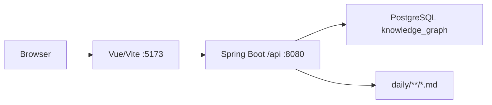

# Architecture

## 总体结构

系统采用前后端分离：

- 前端 Vite 开发服务器运行在 `http://localhost:5173`。
- 后端 Spring Boot 运行在 `http://localhost:8080`。
- Vite 代理将 `/api` 转发到后端。
- 后端连接本地 PostgreSQL 数据库 `knowledge_graph`。



## 后端分层

- `controller`：接收 REST 请求，返回统一 `ApiResponse`。
- `service`：业务接口。
- `service/impl`：业务实现，组合 Mapper 和解析逻辑。
- `mapper`：MyBatis Plus 数据访问。
- `entity`：表结构映射。
- `config/JsonbTypeHandler.java`：处理 PostgreSQL JSONB 字段。

所有接口保持统一返回格式：

```json
{ "code": 0, "message": "success", "data": {} }
```

## 前端结构

- `router/index.js` 定义页面路由。
- `api/http.js` 封装 Axios，默认 `baseURL` 为 `/api`。
- `components/` 放公共组件。
- `views/` 放页面级组件。
- `styles/variables.css` 放全局设计变量。

已存在路由：

```text
/
/knowledge
/issues
/projects
/prompts
/graph
/timeline
/search
/daily
/daily/:id
/reports -> /daily
```

## 核心业务模块

- Dashboard：汇总指标和近期列表。
- Knowledge：知识卡片 CRUD。
- Issues：问题记录 CRUD 和解决状态。
- Projects：项目记录 CRUD。
- Prompts：Prompt 记录 CRUD。
- Graph：节点聚合和关系维护。
- Timeline：时间轴事件。
- Search：全局关键字搜索。
- Daily Brief：Markdown 日报列表、详情、同步和关系。

